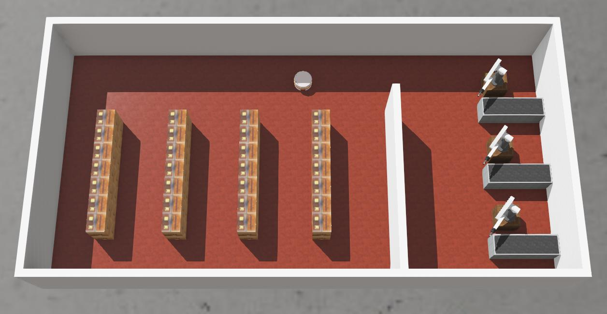

# MPC-RBT Simulator

This ROS 2 package embodies a Webots-based simulation environment for the lab tasks of the MPC-RBT course. The simulated scenario involves a small warehouse equipped with a compact mobile robot to fulfill tasks such as pick-and-place operations. The overall goal is to tackle basic challenges in mobile robotics, including self-localization, path planning, and motion control, as well as to become familiar with both the ROS 2 framework and the Webots simulator.



TODO: add some details (robot model, senosrs etc)

## Installation

To run the project (use this package) various software requirements must be met. This section briefly describes the installation procedure.

### Ubuntu

The project requires Ubuntu 22.04 LTS. Follow the official installation guide to install it:

https://ubuntu.com/tutorials/install-ubuntu-desktop#1-overview

**Warning:** proceed carefully to prevent possible data loss in case of installation on a PC/Laptop with another operating system. 

### ROS 2

The key software framework used in this project is ROS 2 Humble. To install it from pre-build binary package follow this official guide:

https://docs.ros.org/en/humble/Installation/Alternatives/Ubuntu-Install-Binary.html

### Webots

Webots is the desktop application used to simulate robots and environment in this project. It requires Webots 2023b version. One way to install it is to download `webots_2023b_amd64.deb` package from the release page:

https://github.com/cyberbotics/webots/releases/tag/R2023b

And install it from the same directory using:

```
wget https://github.com/cyberbotics/webots/releases/download/R2023b/webots_2023b_amd64.deb && sudo apt install ./webots_2023b_amd64.deb
```

Another options are listed here:

https://cyberbotics.com/doc/guide/installation-procedure?tab-os=linux#installation-on-linux

### ROS 2 Workspace

ROS 2 workspace is represented by a directory, `mpc-rbt_ws` for example, and packages are typically located in the `src` subdirectory. Navigate to the desired location and create them:

```
mkdir mpc-rbt_ws
cd mpc-rbt_ws
mkdir src
```

### MPC-RBT Simulator

This repository embodies a ROS 2 package. Navigate to the `mpc-rbt_ws/src` and clone it:

```
git clone git@github.com:Robotics-BUT/mpc-rbt-simulator.git
```

Package dependencies (mostly another ROS 2 packages) are listed in the `package.xml` and can be installed either manually (from source or binary) or automatically via `rosdep` utility.

Install the `rosdep` (if necessary):

```
apt-get install python3-rosdep
```

Initialize it and update rosdistro index:

```
sudo rosdep init
rosdep update
```

Install the dependencies using the following command from the workspace root directory:

```
rosdep install --from-paths src -y --ignore-src --rosdistro humble
```

Most of the dependencies are a common part of the ROS distribution. The exception is the package `webots_ros2_driver` which is necessary to connect the ROS 2 and Webots simulator.


### Visual Studio Code

Any IDE may be used to work on this projet. Visual Studio Code, for example, is a good choice. To install it, download `.deb` package from the official website:

https://code.visualstudio.com/

Install it from the same directory using:

```
sudo apt install ./<file>.deb
```


## Package Structure

TODO

## Usage

TODO

Navigate to the workspace root directory (`mpc-rbt_ws`) and build it:

```
colcon build
```

Set up the environment for the workspace:

```
source install/setup.bash
```

Launch the project (including the simulation) using:

```
ros2 launch mpc-rbt-simulator simulation.launch.py
```

## Testing

Navigate to the workspace root directory (`mpc-rbt_ws`) and build it:

```
colcon build
```

Spawn the simulation with the robot controller using:

```
webots --port=1234 --no-rendering --stdout --stderr --minimize ./worlds/mpc-rbt-warehouse.wbt --batch --mode=realtime
```
>**NOTE**: If you want to watch the simulation during tests remove the `--no-rendering` and `--minimize` arguments.

Run tests using:

```
WEBOTS_CONTROLLER_PORT=1234 colcon test --ctest-args tests
```

View the results using:
```
colcon test-result --verbose --all
```

## TODO

- Create a static 2D map (occupancy grid) for given world for the path planning purposes OR create an automatic converter .wbt -> .pgm (occupancy grid)
- Add a map server to provide a static map for path planning a rviz visualization
- Implement robot stop if the driver doesn't receive cmd_vel messages
- Prepare templates (source files, nodes..) for students for the individual tasks, eg localization, path planning..
- Validate robot parameters - wheel radius and distance
- Remove unnecessary topics
- Running the project in labs: ROS_DOMAIN_ID per student / ROS_LOCALHOST_ONLY; where to store student work (GitHub/locally/..)?
- Create documentation (install, usage..)

## Issues

- Fix and simplify the robot .urdf model - some transforms don't exist (casters), some frames aren't necessary.
- Fix namespaces - some topics already have /tiago_base namespace provided by Webots 